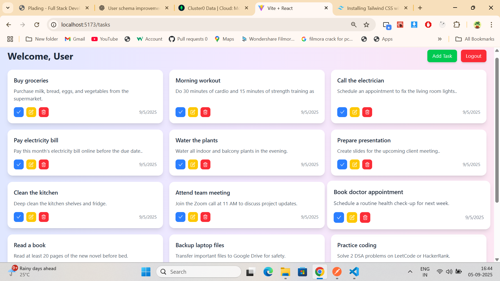

# Task Management App

A full-stack Task Management application with **CRUD operations** for tasks and **user authentication** (Sign In / Sign Out). Built with **React** for the frontend and **Node.js/Express** with **MongoDB** for the backend.

---

## Features

- **User Authentication**
  - Sign Up
  - Sign In
  - Sign Out
- **Task Management (CRUD)**
  - Create tasks
  - Read/view tasks
  - Update tasks
  - Delete tasks
- Responsive UI using React
- RESTful API backend with Express
- MongoDB database for persistent storage

---

## Project Structure

